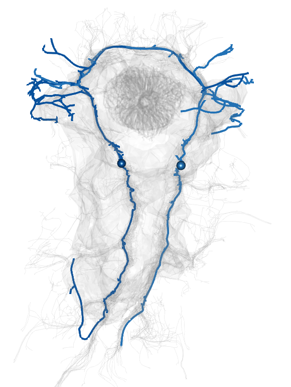

```{r xaringanExtra, echo=FALSE}
xaringanExtra::use_xaringan_extra(c("tile_view", "animate_css", "tachyons"))
#to load xaringanExtra in a single call
```

```{r xaringan-editable, echo=FALSE}
xaringanExtra::use_editable(expires = 1)
#makes slides editable  to make a component of your slides editable, use the .can-edit[] class.

```

```{r xaringan-scribble, echo=FALSE}
xaringanExtra::use_scribble()
#to draw on slides
```

```{r xaringan-panelset, echo=FALSE}
xaringanExtra::use_panelset()
#to add panels to slides with
#.panel[.panel-name[NAME]
#...content...
#]
```

---
#Why do we need open science

---
##Scientists rename human genes to stop Microsoft Excel from misreading them as dates

https://www.theverge.com/2020/8/6/21355674/human-genes-rename-microsoft-excel-misreading-dates

---
#Gene name errors are widespread in the scientific literature

</br>


.red[*"The spreadsheet software Microsoft Excel, when used with default settings, is known to convert gene names to dates and floating-point numbers."*]

.footnote[___
[Ziemann et al. (2016)](https://genomebiology.biomedcentral.com/articles/10.1186/s13059-016-1044-7)]


---
class: left

#Installing packages

* install the **tidyverse** package
```{r eval=FALSE, tidy=FALSE}
install.packages("tidyverse")
```


* then load the package
```{r eval=TRUE, tidy=FALSE}
library(tidyverse)
library(xaringan)

#you can source several packages and functions, listed in one file
source("code/packages_and_functions.R")
```

---
class: center

# Your workspace in R

*Recreate, rather than save workspace, save your code and data, not workspace <br>


---
#A note about working directories

```{r eval=FALSE}
getwd()
```

* ### You should never use absolute paths in your scripts, because they hinder sharing: no one else will have exactly the same directory configuration as you.

* ### R experts keep all the files associated with a project together — input data, R scripts, analytical results, figures. This is such a wise and common practice that RStudio has built-in support for this via projects.

* ### If you create a new Rproject, your working dir will in general be where you save the new project

* ### Whenever you refer to a file with a relative path it will look for it in your wd.
---
# Project management

* ### Use folders relative to your main .Rproject file (e.g. My_next_paper.Rproject)

* ### Use a consistent directory structure to store code, data, text, figures, supplements, etc.

* ### Can be ensured if you always use the same template

* ### We will use https://github.com/JekelyLab/LSI_Rstudio_course

* ### Go to github and clone the project to your account

* ### Go to RStudio -> new project -> version control -> git -> git URL

* ### select local dir and pull the project with all directories to your computer

* ### let's check the template

* ### rename new_project_template.Rproject to 'my favourite file name'

---
#Always save and share your computer environment and packages

```{r echo=TRUE, eval=TRUE}
#save session info and Rstudio version info for reproducibility
writeLines(capture.output(sessionInfo()), "code/sessionInfo.txt")
writeLines(capture.output(rstudioapi::versionInfo()), "code/versionInfo.txt")
```

---

#Data plotting with ggplot2

* ### ggplot2 is part of tidyverse and loads when you load tidyverse
* ### very versatile and extendable data visualisation package
* ### as input, you need a data.frame or tibble

```{r eval = TRUE, echo = TRUE}
iris %>%  #we use a pipe to input the data to ggplot
  ggplot(aes(x = Sepal.Length, y = Sepal.Width, color = Species)) +  #we use + to add different elements of the plot
  geom_point() +
  geom_smooth() +
  theme_minimal()

head(iris)
```

---

```{r  fig.height=6, echo=TRUE}
ggplot(data=diamonds, mapping=aes(x = carat, y = price, color = cut))+
  geom_point()
```
---

```{r  fig.height=6, echo=TRUE}

ggplot(data=diamonds) + 
  geom_histogram(aes(x=carat), binwidth=0.1) +
  geom_freqpoly(mapping=aes(x=carat, color=cut), binwidth=0.1)

```

---
# Shapes


---
#Aesthetics, plot types and themes

* ### need to define 'aesthetics', which variable goes to x, y axes, to color, size, line thickness etc.
* ### need to select plot type (geom_...  boxplot, line, points etc.)
* ### need to define 'theme' such as axis thickness, fonts, ticks, borders etc.

```{r eval = TRUE, echo = TRUE}
iris %>%  
  ggplot(aes(x = Sepal.Length, y = Sepal.Width, color = Species)) +
  geom_boxplot(notch = TRUE) +
  theme_minimal()

```
---
#Faceting

* ### facets are panels of multi-panel plots
* ### we can split our data into panels based on a discrete variable, e.g., species

```{r eval = TRUE, echo = TRUE, fig.height = 4}
iris %>%  
  ggplot(aes(x = Sepal.Length, y = Sepal.Width, color = Species)) +
  geom_point() +
  theme_minimal() +
  facet_wrap(vars(Species))

```
---
#Esquisse 'ggplot2 builder' add-on

* ### helps to generate the code for ggplot
* ### select the data frame to plot
* ### map aesthetics to variables in the gui
* ### define themes, facets, fonts etc.
* ### useful as a 'cheat-sheet'

```{r eval = TRUE, echo = TRUE}
getwd()
iris %>%  
  ggplot(aes(x = Sepal.Length, y = Sepal.Width, color = Species)) +
  geom_point() +
  theme_minimal() +
  facet_wrap(vars(Species)) +
  labs(x = "x axis label", y = "y axis label") +
  theme_minimal() +
  theme(legend.position = "left")

ggsave("pictures/iris_test.png", bg = "white")

```  
  
---
#Tidy your data

* ### Tabular data is a set of values, each associated with a variable and an observation. 

* ### Tabular data is tidy if each value is placed in its own “cell”, each variable in its own column, and each observation in its own row.

* ### “Tidy datasets are all alike, but every messy dataset is messy in its own way.” –– Hadley Wickham

---
#Tidy your data

__There are three interrelated rules which make a dataset tidy:__

* ### Each variable must have its own column.
* ### Each observation must have its own row.
* ### Each value must have its own cell.


---
#Tidy your data

```{r, echo=FALSE}
knitr::kable(head(iris), format = 'html')
```

---

#Tibbles

```{r eval = FALSE}
vignette("tibble")

```

---
#A simple tibble

```{r eval = TRUE, echo = TRUE, fig.height=4}
tb <- tibble(variable_1 = c(1,2,3,4,5,6), 
             variable_2 = c(2,3,4,5,6,7),
             variable_3 =  c("a", "a", "a", "b", "b", "c"))
tb %>%
  ggplot(aes(x = variable_1, y = variable_2, color = variable_3)) +
  geom_point()
```

---
#A more realistic example

```{r eval = TRUE, echo = TRUE, fig.height=4}
tb <- tibble(genotype = c("wt","wt","wt","mut","mut","mut"), 
             eye_color = c("red", "red", "red", "white", "white", "white"),
             eye_size =  c(35, 39, 33, 12, 14, 11))
tb
tb %>%
  ggplot(aes(x = genotype, y = eye_size, color = eye_color)) +
  geom_point()
```

---
#A more realistic example

```{r eval = TRUE, echo = TRUE, fig.height=4}
tb <- tibble(inhibitor = c("DMSO","DMSO","DMSO","drug1","drug1","drug1","drug1","drug1","drug1"), 
             activity = c(32,34,23,67,65,57, 56,64,62),
             replicate =  c("rep1", "rep1", "rep1", "rep1", "rep1", "rep1", "rep2", "rep2", "rep2"))
tb
tb %>%
  ggplot(aes(x = inhibitor, y = activity, color = replicate)) +
  geom_point()
```

---
#Example dataset from from Barnali

```{r eval = TRUE, echo = TRUE}
Syn_data <- read_csv("data/a-Syn-Data.csv")
```

---

```{r eval = TRUE, echo = TRUE, fig.height = 5}

#use piping %>% and pivot_longer to convert into long form
Syn_data %>%
  rename_with(~ gsub("_", "-", .x, fixed = TRUE)) %>%
  rename_with(~ gsub("...", "_", .x, fixed = TRUE)) %>%
  pivot_longer(matches("aSyn"), 
               names_to = c("condition", "sample"), names_sep = "_",
               values_to = "fluorescence") %>%
  group_by(condition) %>%
  ggplot(aes(x = Time, y = fluorescence, color = condition)) +
  geom_smooth() +
  theme_minimal()

```
---
#Assemble multi-panel figures with cowplot and patchwork

### read the images with readPNG from pictures/ folder

``` {r echo = TRUE, eval = TRUE}
img1 <- readPNG("pictures/Platynereis_SEM_inverted_nolabel.png")
img2 <- readPNG("pictures/head_celltypes_syn_matrix.png")
img3 <- readPNG("pictures/iris_test.png")
img4 <- readPNG("pictures/MC3cover-200um.png")

```

---
#Assemble multi-panel figures with cowplot and patchwork

### convert to image panel and add text labels with cowplot::draw_image and draw_label

``` {r echo = TRUE, eval = TRUE}
 
panelA <- cowplot::ggdraw() + cowplot::draw_image(img1, scale = 1) + 
  draw_label("Platynereis larva", x = 0.35, y = 0.99, fontfamily = "sans", fontface = "plain",
             color = "black", size = 11, angle = 0, lineheight = 0.9, alpha = 1) +
  draw_label(expression(paste("50 ", mu, "m")), x = 0.27, y = 0.05, fontfamily = "sans", fontface = "plain",
             color = "black", size = 10, angle = 0, lineheight = 0.9, alpha = 1) + 
  draw_label("head", x = 0.5, y = 0.85, fontfamily = "sans", fontface = "plain",
             color = "black", size = 9, angle = 0, lineheight = 0.9, alpha = 1) + 
  draw_label("sg0", x = 0.52, y = 0.67, fontfamily = "sans", fontface = "plain",
             color = "black", size = 9, angle = 0, lineheight = 0.9, alpha = 1)

```
---
.scrollable[
#Adding scale bars
* ### you could add the scale bar directly on the image e.g., in ImageJ
* ### your scale bars may be misaligned and of varying thickness
* ### you can use cowplot:draw_line
* ### the x positions of the start and end of the line are defined as % of the panel width
* ### if you know the width of the image (can add it to file name), it is easy to calculate the size of the scale bar

``` {r echo = TRUE, eval = TRUE}
panelD <- ggdraw() + draw_image(img4, scale = 1) + 
  draw_line(x = c(0.1, 0.3), y = c(0.07, 0.07), color = "black", size = 0.5)
panelD
```
]
---

background-image: url(https://upload.wikimedia.org/wikipedia/commons/b/be/Sharingan_triple.svg)

# The Xaringan Package to make presenations with RStudio

```{r setup, include=FALSE}
options(htmltools.dir.version = FALSE)
```


Image credit: [Wikimedia Commons](https://commons.wikimedia.org/wiki/File:Sharingan_triple.svg)

---
class: center, middle

# xaringan

### /ʃaː.'riŋ.ɡan/

---
class: inverse, center, middle

# Get Started

---

# Hello World

Install the **xaringan** package from [Github](https://github.com/yihui/xaringan):

```{r eval=FALSE, tidy=FALSE}
remotes::install_github("yihui/xaringan")
```

--

You are recommended to use the [RStudio IDE](https://www.rstudio.com/products/rstudio/), but you do not have to.

- Create a new R Markdown document from the menu `File -> New File -> R Markdown -> From Template -> Ninja Presentation`;<sup>1</sup>

--

- Click the `Knit` button to compile it;

--

- or use the [RStudio Addin](https://rstudio.github.io/rstudioaddins/)<sup>2</sup> "Infinite Moon Reader" to live preview the slides (every time you update and save the Rmd document, the slides will be automatically reloaded in RStudio Viewer.

.footnote[
[1] 中文用户请看[这份教程](https://slides.yihui.org/xaringan/zh-CN.html)

[2] See [#2](https://github.com/yihui/xaringan/issues/2) if you do not see the template or addin in RStudio.
]

---
